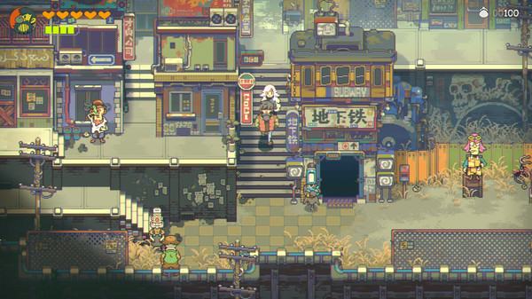
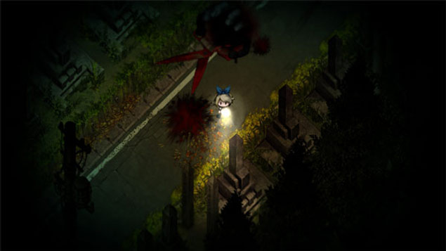

# new Project\(\);

## 关于游戏

> #### xxx 是一款探索解密的剧情向游戏

> **游戏以死亡记忆为主题类。玩家使用键盘进行对角色的控制，通过对地图环境的探索同时与其他 NPC 的互动来收集信息，推动剧情。游戏里设定有多项结局，通过玩家在剧情里的选项选择，剧情会进入不同结局线。游戏以悲剧为主，多数结局为Bad End, 但游戏设有唯一一个Happy End 为真结局。真结局的触发条件需要根据玩家选项的选择和游戏中线索收集程度来决定。此外，游戏中设有可供玩家 DIY 的玩家房间，玩家通过探索地图，搜集可房间编辑的家具来或者通过解锁收集或者剧情成就来获取不同家具。游戏画风以二次元萌系为主，但游戏设定场景偏阴暗阴森。这款游戏以多线程的结局线，对游戏地图剧情的探索，与游戏主线剧情的推动来吸引玩家，呈现给玩家精彩的故事。**


**目前游戏的名称仍在设计当中~**


## 游戏画面设定

        **目前游戏暂定为斜俯视 2D 像素类。类似的作品有即将发布的** [**风来之国**](https://store.steampowered.com/app/977880/Eastward/?l=schinese)**，这种维度既能减少 3D 所需要的模型需求，又可以满足我们这类游戏的一些特点。同时，依靠Tileset, sprite shape 等一些 2D 技术可以打大大降低美术资源的制作。**

## 游戏玩法

        游戏分为**探索**和**战斗**两部分。由于游戏的重心在于探索，所以战斗的部分会偏向于策略类型而不是一般动作类打斗。战斗玩法可以参考 [夜廻&深夜廻](https://nisamerica.com/games/yomawari-midnight-shadows) 。玩家将操作主角躲避Boss的进攻同时出发一些机关达到消灭怪物。探索部分将会是游戏的核心部分。玩家在会通过主线的剧情以及对于游戏地图的探索，收集物资\(触发剧情的而非生存类物资\)，NPC 的交谈来发现每个章节的秘密，从而解锁BOSS 的战斗。

### 探索

* 解密

          在探索游戏中，解密是不可缺少的因素。玩家将会在游戏中与场景里面的物品，人物进行交互，潜入敌人的地方，偷听对话；找寻物品，拼接碎片等一些常见的解密

### 战斗

