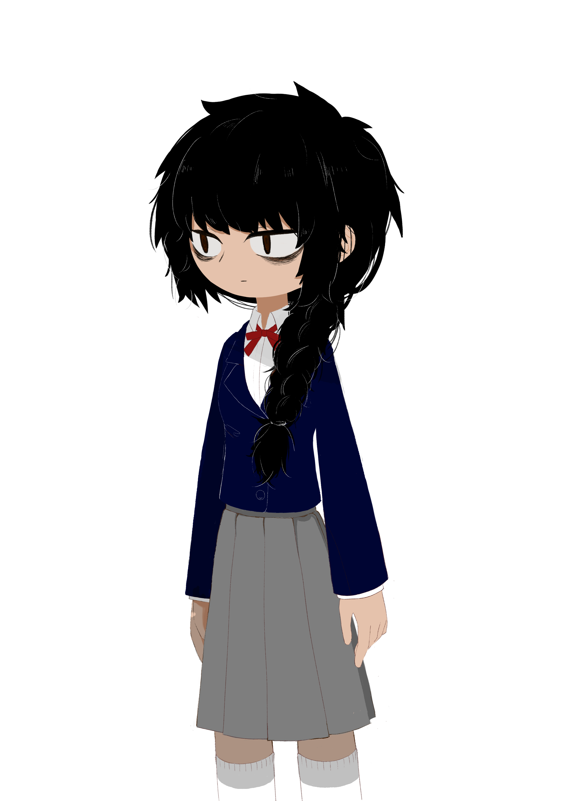
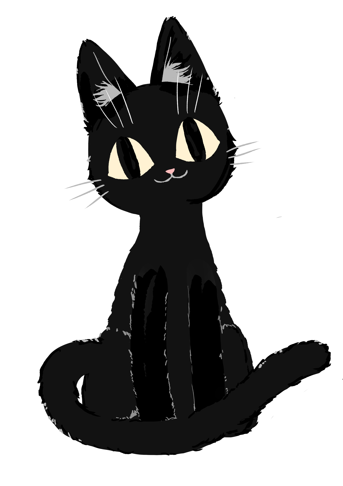

# 角色


 目前游戏的角色名称仍然在推敲之中~


## **角色** 



        **主角的死因设定为自杀，自杀原因暂定。考虑到社会因素和暴力导致主角崩溃自杀，因为没有释怀放下，心中有刺，从而无法转世。作为一个已死之人，忘记了自己的死因，作为一个灵魂在城市里徘徊无法升天进入轮回转世。在一次偶然的情况下，被Void吸引，经过对Void的调查和跟踪，发现Void被恶灵A纠缠处于危机状况。在经过对恶灵的缠斗后，Void和主角成功击败恶灵，同时主角发现，击败恶灵后主角发现恶灵生前的记忆开始出现在自己脑海里。（在Void的帮助下or没有）主角获得了恶灵死前的记忆包括恶灵的死因，为什么死，死后为什么没有轮回反而堕落为恶灵等。同时，主角通过恶灵的记忆发现关于自己死因的记忆回想起了一部分（或者造成自己死亡的因素和恶灵的记忆有关）。因此，在经历了这回事件后为了恢复失去的记忆，主角和Void组成了搭档，开始搜集城市里恶灵的信息。以搜寻恶灵并且击败其为目的，一步步揭开自己失去的记忆，踏上了探索的故事。**




**暂时为设定Void的人设情况。考虑的方案有几种：**

1. **Void是一只有灵能力的猫（或者类似的东西，外表能让玩家喜欢）。**
2. **Void是一种有奇异能力的灵（大概像鬼魂类的吉祥物）。**

 **总之Void会作为游戏吉祥物一样的存在，同时也是指引玩家游戏方向的导航，在剧情推动上和玩家玩法探索上给予帮助。（使玩家对Void有羁绊感和依赖感。Void设定有好感值。**

* **剧情里：Void在被主角解救后，开始与主角一起行动。Void自身拥有着灵能力，他在主角搜寻探索的路上对主角提供了许多帮助。**
  * **Void的身世是：？**
* **好感度：Void对主角设有好感度。随着好感度的提高，Void与玩家之间的日常对话也会有所改变。同时好感度系统会对玩家玩法上有改变，随着好感度的增长，Void能解锁一些能力帮助玩家搜寻探索，或者解锁道路。同时好感度的达成能为玩家带来新的对话选择分支。唯一的Happy End的触发条件之一就是需要最终Void的好感度为满的。**
* **玩法上： Void作为伙伴，它代替了其他游戏里的回忆或者记录系统，当玩家发现新的线索或者收集到了新的回忆时，Void帮忙保存。随着好感度的提升（暂时分为三个阶段），每到达一定程度时就能解锁一项能力（暂定）。**  




        **暂定有5段剧情，与之对应的是5个恶灵，每个恶灵都有着各自生前的死因已经最终堕落为恶灵的原因。**

| 恶灵名称 | 介绍 | 角色图 | 备注 |
| :---: | :---: | :---: | :--- |
| A |  |  | **家庭: 父入狱，母女独自生活遭社会的stereotype歧视母亲情绪失常，对女主造成伤害。** |
| B |  |  | **初中（初一）不让去上厕所，翻窗出门，当众人面失禁遭嘲笑，老师旁观&指责女主，绰号，遇见boss** |
| C |  |  | **高中: 网络暴力, 被拍到与boss的照片, 提到绰, 因为社会压力离去的朋友** |
| D |  |  | **Boss背景故事: 遭受社会的抛弃，儿时经历母亲变态的成长培养。** |
| E |  |  | **Boss: Boss-串联所有故事, 邻居&学校心理辅导-光&破灭 boss 以女主的负面情绪为食，后来女主在void的影响下变得逐渐与boss想要的结果不同，第4关将引导女主进入回忆环节，揭示事情的原委，显现原形，进入boss战。** |



一个处在喧嚣都市中宁静的咖啡店老板，他的身世很神秘，但是面人和蔼亲切。在店里的柜台上一直趴着一直小黑猫。



